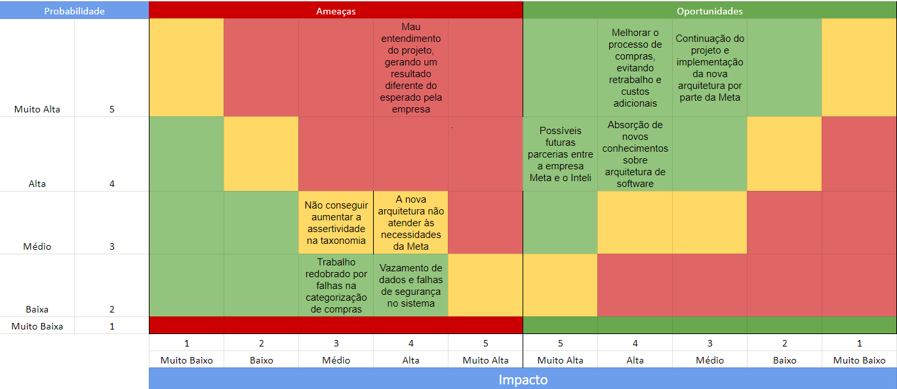

## 1.1 Busines drivers 

Finalidade baseada em dados -   Fluxo de Negocio associado ao sistema

### 1. Setor de aplicação

 - Compras e sourcing estrategico.

### 2. Adição de Valor

O sistema fornece uma abordagem estruturada e sistemática para transformar a função de compras de "transacional" para "estratégico". Isso otimiza as operações de negócios, identifica os principais players do mercado, e facilita a implementação de acordos de fornecimento.

### 3. Processo de negócio e fluxos críticos suportados pelo sistema:

Dada a importância da correta categorização dos dados, é essencial que um sistema como este seja meticuloso e preciso em sua função. O foco primordial deve ser na precisão da categorização. 

 - **NORAM**: Aproximadamente 50.000 unidades, que representa cerca de 7,1% do total de suas compras.
 - **EMEA**: Perto de 100.000 unidades, ou seja, 33% do total.

 - **APAC** e LATAM: Menores em comparação com as outras regiões.

Embora a integridade dos dados e a proteção contra acessos indevidos sejam importantes, a atual incapacidade do sistema em categorizar as informações de forma adequada é o seu maior ponto de vulnerabilidade, especialmente quando se lida com informações financeiras tão sensíveis e críticas.

### 4. Volumetria

Análise detalhada e uma visão abrangente dos gastos da empresa com seus fornecedores em diversas categorias.

O sistema "AP Invoicing Spend" e a tabela de dados  fornecem uma análise detalhada e uma visão abrangente dos gastos da empresa com seus fornecedores em diversas categorias.

#### Compras por região:

 - NORAM aproximadamente 800.000 unidades.

 - EMEA aproximadamente 300.000 unidades.

 - APAC e LATAM têm volumes de compra muito menores em comparação, ambos abaixo de 100.000.

#### Maior Volume de compras por Categoria:

 - Online Operations: Aproximadamente 65.000 - 93%.
 - HR Operations: Aproximadamente 5.000 - 7%.
 - Legal: Aproximadamente 4.000 - 5.7%.
 - Global Marketing Solutions: Aproximadamente 3.000 - 4.3%.
 - R&D: Aproximadamente 2.000 - 2.9%.
 - IT & Cornet: Aproximadamente 1.000 - 1.4% .
 - Não categorizado: Aproximadamente 15.000  - 21.4%

#### Maiores despesas por Categoria:

 - Real Estate & Facilities: Gasto total de $11,176,824,880, representando 22.8% dos gastos totais, com 2,324 fornecedores distintos e 150,668 faturas.

 - Professional Services: Gasto de $7,078,779,982, o que equivale a 14.4% do total, com 2,909 fornecedores distintos e 75,249 faturas.
 
 - Sales, Marketing & Events: $5,357,703,180 gastos, ou 10.9% do total, com 4,919 fornecedores e 32,965 faturas.
 
 - Manufacturing: Gasto de $2,497,227,464, equivalente a 5.1% do total, com 395 fornecedores e 7,377 faturas.
 
 - Entre outras categorias listadas.
   
#### Fornecedores Principais:

 - DUCEN NAVIDIA CORPORATION: Gasto de $4,854,135,785 (9.9% dos gastos totais) com 271 fornecedores distintos e 1,166 faturas.
 
 - WINNIN CORPORATION: Gasto de $3,111,238,469 (6.7% dos gastos totais) com 438 fornecedores distintos e 2,542 faturas.
 
 - CUSHMAN & WAKEFIELD PLC: Gasto de $1,300,931,490 (3.3% do total) com 8 fornecedores distintos e 1,900 faturas.
 
 - ACS, ACTIVIDADES DE CONSTRUCCION Y SERVICIOS, SA: Gasto de $1,531,594,767 (3.1% dos gastos totais) com 514 fornecedores distintos e 1,557 faturas.
 - Entre outros fornecedores listados.

#### Distribuição de Gastos por LE (Entidade Legal):

 - Meta Platforms, Inc.: Gasto de $14,574,470,643, representando 20.0% dos gastos totais com 5,212 fornecedores distintos e 110,247 faturas.

 - Facebook Platforms Technologies, LLC: Gasto de $3,846,926,219, que é 7.8% dos gastos totais com 3,335 fornecedores distintos e 26,754 faturas.
 
 - FB International Procurement Limited: Gasto de $1,203,006,264, que é 2.5% dos gastos totais com 415 fornecedores distintos e 238 faturas.

### 5. Estrategia de Crescimento Estabelecida 

#### 1. Aprimoramento na Precisão da Classificação:

Tendo em vista que mais de 30% das classificações realizadas nas análises estão erradas, é essencial priorizar a correção deste aspecto. Investir em ferramentas mais sofisticadas de análise de dados, bem como treinamento adequado para a equipe, pode ajudar a reduzir significativamente essa taxa de erro.

#### 2. Revisão e Validação de Dados:

Implemente um processo de revisão e validação de dados para garantir que todas as entradas sejam verificadas antes da finalização da análise. Isto pode incluir verificações manuais, bem como automações para identificar inconsistências.

 #### 3. Pontos a serem considerados
 
 - Foco no Principal Setor de Aplicação:
Ao otimizar a precisão das classificações nesse setor, podemos garantir que os recursos sejam direcionados de forma mais eficaz, maximizando o retorno sobre o investimento.

 - Parcerias Estratégicas com Fornecedores Principais:
Estabelecer relações mais próximas com fornecedores chave, como "DUCEN NA VIEDMA CORPORATION" e "WINWIN CORPORATION", para melhorar a comunicação e garantir que os dados fornecidos sejam precisos e atualizados regularmente.

 - Investimento em P&D:
A inovação é chave para permanecer competitivo. Ao focar em Pesquisa e Desenvolvimento, especialmente em áreas críticas onde os gastos são altos, a empresa pode descobrir novas formas de otimizar processos e reduzir custos.

 - Feedback e Melhoria Contínua:
Estabeleça um sistema de feedback onde os erros identificados são comunicados de volta à equipe responsável. Isto cria um ciclo de melhoria contínua, onde os erros são usados como oportunidades de aprendizado e otimização.

Implementando estas estratégias e dando prioridade à precisão dos dados, a Meta pode esperar uma análise mais confiável, levando a decisões de negócios mais informadas e resultados mais bem-sucedidos.

## 1.2 Riscos e Oportunidades

### Matriz de Risco

### Oportunidade de melhoria das SLAs

## 1.3 Modelo de simulação do atual 

Para destacar os pontos críticos do sistema e apresentar uma análise dos resultados das simulações, vou abordar cada um dos três Requisitos Não Funcionais (RNFs) individualmente.

### RFN1: Acurácia

A simulação realizada para avaliar a acurácia do sistema se baseia em um modelo de classificação e utiliza uma cadeia de Markov para simular transições entre estados "Certo" e "Errado". Os elementos envolvidos na simulação são fundamentais para avaliar a precisão do sistema. O objetivo é destacar as áreas de vulnerabilidade e oportunidades de melhoria na acurácia do sistema.

**Resultados da Simulação:**

A simulação forneceu resultados que indicam a acurácia do sistema atual e do sistema proposto. Foram gerados gráficos e dados estatísticos para analisar o desempenho em termos de classificações corretas e incorretas. Os pontos críticos destacados incluem:

1. **Acurácia do Sistema Atual:** A simulação revelou que o sistema atual possui uma acurácia média de aproximadamente 70%, com flutuações ao longo do tempo. Isso indica áreas de melhoria na precisão das classificações.

2. **Acurácia do Sistema Proposto:** O sistema proposto na simulação mostrou uma melhoria significativa na acurácia, atingindo consistentemente mais de 95% de precisão. Isso representa uma oportunidade valiosa de aprimoramento.

3. **Variação nos Resultados:** A simulação destacou a variabilidade nos resultados do sistema atual, com flutuações que podem afetar a confiabilidade das classificações. O sistema proposto reduziu significativamente essa variabilidade.

**Conclusão:**

Com base nos resultados da simulação, a acurácia do sistema atual é uma área crítica que requer melhorias. O sistema proposto demonstrou um desempenho substancialmente melhor, atendendo ao requisito de 95% de acurácia. Essa é uma oportunidade importante de aprimoramento para aumentar a confiabilidade do sistema.

### RFN2: Disponibilidade

A simulação para avaliar a disponibilidade do sistema envolveu a geração de requisições de usuários e a simulação de falhas e manutenções. O objetivo é destacar os pontos críticos em termos de disponibilidade do sistema e identificar áreas de risco e oportunidade.

**Resultados da Simulação:**

A simulação de disponibilidade revelou informações valiosas sobre o comportamento do sistema atual em relação às interrupções e tempos de funcionamento. Os principais resultados incluem:

1. **Disponibilidade do Sistema Atual:** O sistema atual demonstrou alta disponibilidade, com uma média de 100 requisições por minuto sendo atendidas. A simulação mostrou que as interrupções, principalmente durante os fins de semana, não afetaram significativamente a utilização do sistema.

2. **Necessidade de Melhorias:** Embora a disponibilidade seja alta, a simulação destacou que interrupções temporárias e manutenções ainda podem atrasar a implementação de novas funcionalidades no futuro. Isso indica a necessidade de considerar aprimoramentos na disponibilidade.

3. **Dados para Cálculo de MTBF e MTTR:** A simulação forneceu dados que podem ser usados para calcular o Tempo Médio Entre Falhas (MTBF) e o Tempo Médio de Reparo (MTTR), que são métricas cruciais para avaliar a disponibilidade.

**Conclusão:**

A disponibilidade do sistema atual é geralmente alta, mas a simulação identificou a possibilidade de atrasos devido a interrupções temporárias. Essas informações podem ser usadas para aprimorar a estratégia de disponibilidade no futuro, caso haja planos de implementação de novas funcionalidades.

### RFN3: Desempenho

A simulação de desempenho envolveu a comparação do tempo de resposta entre o Sistema Atual (API 1) e o Sistema Novo (API 2). O objetivo é destacar os pontos críticos em termos de desempenho e identificar áreas que exigem aprimoramento.

**Resultados da Simulação:**

A simulação de desempenho ofereceu uma comparação direta entre o Sistema Atual e o Sistema Novo. Os principais resultados incluem:

1. **Tempo de Resposta do Sistema Atual:** O sistema atual demonstrou um tempo de resposta variável, com algumas chamadas levando mais de 1 segundo para serem concluídas. Isso indica pontos críticos em termos de desempenho.

2. **Tempo de Resposta do Sistema Novo:** O sistema novo apresentou um desempenho mais consistente, com a maioria das chamadas sendo concluídas em menos de 1 segundo. Isso representa uma melhoria significativa em relação ao Sistema Atual.

3. **Comparação Visual:** O gráfico de dispersão permitiu uma comparação visual direta entre os tempos de resposta dos dois sistemas. Ficou evidente que o Sistema Novo superou o Sistema Atual em termos de desempenho.

**Conclusão:**

A simulação de desempenho demonstrou claramente que o Sistema Novo supera o Sistema Atual em termos de tempo de resposta. Isso destaca a importância de implementar o Sistema Novo para melhorar o desempenho do sistema.

Em resumo, as simulações realizadas para avaliar os Requisitos Não Funcionais (RNFs) destacaram áreas críticas de risco e oportunidade. A acurácia, a disponibilidade e o desempenho do sistema foram avaliados, e os resultados indicaram melhorias significativas no Sistema Novo em relação ao Sistema Atual. Isso fornece uma base sólida para tomar decisões informadas sobre a melhoria da arquitetura do sistema e a implementação de novas funcionalidades no futuro.

# Especificações

## 2 - Requisitos

### Autenticação de usuários na plataforma onde são feitos e classificados os pedidos de compra (Segurança)

A entrada seria a tentativa de login do usuário sem autenticação, a saída seria a permissão de acesso apenas para usuários autenticados e a abordagem de controle seria uma verificação da whitelist de acesso do sistema quando é feita a tentativa de login, registrando por meio de logs os dados de acesso, horário, local.

Para uma prevenção de possíveis acessos indevidos, seria feita a utilização de tokens de acesso fornecidos apenas quando o usuário é autenticado e tem permissão de uso do sistema, esse token que por sua vez é validado a cada requisição para o servidor.

Estabelecer monitoramento contínuo da segurança do sistema para identificar qualquer atividade suspeita e responder a possíveis ameaças de forma pró-ativa por meio da implementação de um sistema de gerenciamento de identidade que permita gerenciar de forma eficaz as permissões e privilégios dos usuários caso a autenticação de tokens falhe.

### Disponibilidade do modelo de taxonomia (Disponibilidade)

A entrada é a o monitoramento e registro de status de disponibilidade do modelo, a saída seria uma disponibilidade de 90% obedecendo uma distribuição normal com desvio padrão de 10% de um site no sistema atual*. Testes de requisição diários e análise de logs.

Considerando os processos da simulação do sistema atual, durante o fluxo se o sistema tiver acima de 10% de indisponibilidade a equipe responsável de sustentação do sistema receberá uma notificação para que a solução de problemas seja feita dentro de 1 dia, caso isso não seja resolvido um sistema automático de replicação do sistema web do fornecedor dos serviços em nuvem é ativado, com maiores custos envolvidos dentro do SLA.

SLA com Fornecedor de Serviços em Nuvem: Certificar-se de que o fornecedor de serviços em nuvem tenha um acordo de nível de serviço (SLA) que defina os termos para a recuperação de serviços. O SLA deve incluir compromissos de disponibilidade e tempos de recuperação em caso de interrupções.

_*Disclaimer: as medições são valores estipulado sem base nos dados reais da Meta, já que esse dado não está disponível até o momento que esse documento foi redigido._

### Medidas de acurácia com identificação de classificações errôneas (Acurácia)

A entrada seria o modelo sem identificação de classificações com confiabilidade baixa, a saída seria uma análise de confiabilidade e registro de dados errôneos e para o controle seria feito uma validação humana por um especialista.

Utilização de dados adquiridos em classificações errôneas para retreinar o modelo, para evitar vieses de interferência no processo de taxonomia com base nos padrões de classificações erradas.

É importante implementar um sistema de monitoramento proativo que rastreie a confiabilidade do sistema em tempo real. Isso inclui a coleta de métricas de desempenho, como tempos de resposta e taxas de erros, além de configurar alertas que acionam automaticamente quando a confiabilidade do sistema cair abaixo do limite de 95%, para serem enviados para a equipe de desenvolvimento.

# **Disclaimer:**
 Os resultados das simulações do Sistema Atual são baseados em dados estimados e não devem ser usados para tomar decisões de negócios. Eles são fornecidos apenas para fins de demonstração. Após o fornecimento de dados reais, as simulações podem ser reexecutadas para obter resultados mais precisos.

