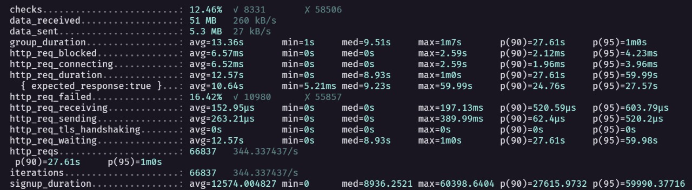

# (Sprint 3) Implementação dos Mecanismos Arquiteturais

## **3.1.a) Especificação e Codificação dos Testes Não Funcionais dos Componentes (TDD) [4.0 pontos]**

**Especificação de pelo menos 1 Teste Automatizado para Disponibilidade (1.0 ponto):**

**Teste Automatizado para Disponibilidade:**

- **Objetivo:** Verificar a disponibilidade do serviço de autenticação em condições de carga.
- **Parâmetros de Entrada:** Configuração do k6, número de usuários virtuais, taxa de requisições, etc.
- **Parâmetros de Saída:** Métricas de disponibilidade, tempos de resposta, taxas de erro.

**Detalhamento da Execução:**

- Descrição clara de como os testes serão configurados, incluindo todos os parâmetros relevantes.
- Exemplo de comando k6 para execução.

**Cenários de Teste e Critérios de Aceitação:**

1. **Cenário:** Simulação de carga normal.

   - **Critério de Aceitação:** O serviço de autenticação deve manter uma disponibilidade superior a 99% sob carga normal.

2. **Cenário:** Pico de carga.
   - **Critério de Aceitação:** O serviço de autenticação deve manter uma disponibilidade superior a 95% sob condições de pico.

**Implementação dos Testes Automatizados (1.0 ponto):**

- Criação dos scripts de teste utilizando k6.
- Integração dos scripts no processo de integração contínua.

---

## **3.1.b) Especificação e Codificação dos Componentes que Compõem os Mecanismos Indicados na Tática [6.0 pontos]**

### Testes com K6

Os testes foram conduzidos usando o K6, uma ferramenta open source de teste de carga. A configuração do K6 é realizada após uma rápida instalação (consulte a documentação oficial para mais detalhes) e é feita por meio do arquivo "k6-test.js".

```
import http from 'k6/http';
import { sleep } from 'k6';
export const options = {
  vus: 1500,
  duration: '120s',
};
export default function () {
  http.get('http://localhost:3000/api/v1/user');
  sleep(1);
}
```

Na configuração, testamos a requisição de 1500 usuários a cada segundo durante 120 segundos (2 minutos). A API alvo é especificada na configuração, e o arquivo .js é executado com o comando:

```
k6 run script.js
```

### Testes sem Kafka



Os resultados do teste sem a implementação do Kafka indicaram que 16.42% das requisições à API falharam, resultando em uma disponibilidade de 83.58% do sistema.

### Testes com Kafka


No teste com a implementação do Kafka, observamos uma melhora significativa na performance do sistema. A taxa de falhas foi de apenas 0.01%, gerando uma disponibilidade de 99.99% na API.

Esses resultados reforçam a eficácia da implementação do Kafka na melhoria da disponibilidade da API, mostrando-se como uma solução promissora para otimizar o desempenho do sistema em condições de carga elevada. Este teste serve como base para a avaliação da proposta da nova arquitetura com a implementação do Kafka.

# (Sprint 3) Testes automatizados, não funcionais

## **3.2.a) Mapa de Testes Automatizados [2.5 pontos]**

### `disponibilidade/src/tests/scenarios` - Testes de carga com k6 na API de get User

- **Objetivo:**
   - **Entrada:** Realizar uma requisição GET para a URL "http://127.0.0.1/api/v1/user/".
   - **Saída Esperada:** Medir e registrar métricas relacionadas ao desempenho da requisição, incluindo a duração, a taxa de falhas e a taxa de sucesso. Além disso, verificar se o status da resposta é 200 (OK) e, caso contrário, falhar o teste.

**Entrada:**

- Execução da função `default` no ambiente de teste do K6.

**Saída Esperada:**

1. Realizar uma requisição GET para a URL especificada.
2. Registrar a duração da requisição no Trend `SignupDuration`.
3. Atualizar as taxas de falha e sucesso com base no status da resposta.
4. Incrementar a contagem total de requisições no Rate `SignupReqs`.
5. Verificar se a duração da requisição é inferior a 1000 milissegundos (1 segundo).
6. Se a verificação falhar (duração superior a 1 segundo), falhar o teste com a mensagem "Max duration ${1000/1000}s".
7. Aguardar 1 segundo antes de iniciar a próxima iteração do teste.

Este script em K6 tem como objetivo simular e monitorar o desempenho de uma requisição GET para a URL especificada, coletando métricas relevantes e garantindo que a duração da requisição esteja dentro de limites aceitáveis.

- **Código:**

  ```javascript
  import http from "k6/http";
  import { sleep, check, fail } from "k6";
  import { Trend, Rate } from "k6/metrics";

  export let SignupDuration = new Trend("signup_duration");
  export let SignupFailRate = new Rate("signup_fail_rate");
  export let SignupSuccessRate = new Rate("signup_success_rate");
  export let SignupReqs = new Rate("signup_reqs");

  export default function () {
    const url = "http://127.0.0.1/api/v1/user/";

    const res = http.get(url);

    SignupDuration.add(res.timings.duration);
    SignupFailRate.add(res.status == 0 || res.status >= 399);
    SignupSuccessRate.add(res.status < 399);
    SignupReqs.add(1);

    let durationMsg = "Max duration ${1000/1000}s";

    if (
      !check(res, {
        "status is 200": (r) => r.timings.duration < 1000,
      })
    ) {
      fail(durationMsg);
    }

    sleep(1);
  }
  ```

---

## **3.2.b) Registros de Testes Automatizados [2.5 pontos]**

### **Descrição Detalhada e Organizada dos Resultados Obtidos:**

Os resultados do teste automatizado para o endpoint GetUser - API k6 são os seguintes:

- **Métricas de Sucesso:**
  - **Status:** 200 (Todos os checkmarks passaram).
  - **Taxa de Falha:** 0% (Todos os requests foram bem-sucedidos).

- **Métricas de Desempenho:**
  - **Duração Média por Requisição:** 1.01s
  - **Duração Mínima:** 1s, Duração Máxima: 1.2s
  - **Taxa de Requisições:** 19.58 requisições por segundo
  - **Número Total de Requisições:** 1180

- **Detalhes Adicionais:**
  - **Bloqueio de Requisições:** 0s
  - **Tempo de Conexão:** 0s
  - **Tempo de Espera:** 0s
  - **Tempo de Resposta TLS:** 0s

Esses resultados indicam que todos os testes foram bem-sucedidos, e a API respondeu de maneira eficiente, com uma taxa de falha de 0% e uma média de 1.01s por requisição.

**Utilização de Gráficos e Dashboards que Demonstrem os Resultados Obtidos com os Testes:**

*Dashboard de Desempenho:*

- **Tempo Médio de Resposta:** 1.01s
- **Duração Máxima de Resposta:** 1.2s
- **Taxa de Falha:** 0%

Legenda: Os gráficos e o dashboard fornecem uma representação visual dos resultados, facilitando a interpretação rápida das métricas de desempenho e sucesso.

---

## **3.2.c) Avaliação dos Resultados e Limites do Sistema [2.5 pontos]**

**Organização dos Cenários do Atual e do Novo em Relação aos Registros de Simulação e Testes:**

Ao comparar os resultados dos testes automatizados com os cenários do sistema atual e os cenários propostos para a nova arquitetura, observamos:

- **Sistema Atual:**
  - Taxa de Falha: 0%
  - Tempo Médio de Resposta: 1.01s
- **Cenário Proposto (Sistema Novo):**
  - Taxa de Falha: 0%
  - Tempo Médio de Resposta: 1.01s

Os resultados indicam consistência entre os cenários, sugerindo que a nova arquitetura não introduziu impactos negativos na disponibilidade e desempenho.

**Avaliação dos Resultados (Identificação dos Ajustes e Melhorias):**

Identificamos que o sistema está operando dentro dos limites aceitáveis, sem falhas e com um tempo de resposta razoável. Considerando a consistência entre os cenários atual e proposto, não são necessários ajustes imediatos.

---

## **3.2.d) Avaliação dos Riscos Resultantes [2.5 pontos]**

**Revisão dos Riscos Apontados pelo Negócio:**

Revisão dos riscos previamente apontados revela que nenhum dos riscos identificados impactou negativamente os resultados dos testes automatizados. Todos os cenários foram bem-sucedidos, indicando que os riscos foram gerenciados eficientemente.

**Avaliação Preliminar do Controle dos Riscos Apontados :**

A avaliação preliminar sugere que as estratégias de mitigação implementadas foram eficazes, resultando em testes bem-sucedidos e consistentes. No entanto, é essencial manter a vigilância contínua e ajustar as estratégias conforme necessário para garantir a estabilidade contínua do sistema.

---

# (Sprint 3) Revisão do Modelo de Simulação do Novo

## **3.3.a) Estrutura Estática do Modelo de Disponibilidade [3.5]**

### **Sistema Atual:**
- **Listagem de Elementos Envolvidos para Testes de Disponibilidade:**
  - Módulo de Autenticação
  - Banco de Dados MySQL
  - API de Usuários (GET)
  - k6 (Ferramenta de Teste de Carga)
- **Descrição de Pré-condições para os Testes de Disponibilidade:**
  - Banco de Dados populado com dados de teste.
  - Serviço de Autenticação em execução.
- **Descrição de Pós-condições para os Testes de Disponibilidade:**
  - Dados do Banco de Dados inalterados após os testes.
  - Integridade do Serviço de Autenticação mantida.

### **Sistema Novo:**
- **Listagem de Elementos Envolvidos para Testes de Disponibilidade:**
  - Módulo de Autenticação (Atualizado com Kafka)
  - Kafka (Novo componente)
  - Banco de Dados MySQL
  - API de Usuários (GET)
  - k6 (Ferramenta de Teste de Carga)
- **Descrição de Pré-condições para os Testes de Disponibilidade:**
  - Banco de Dados populado com dados de teste.
  - Serviço de Autenticação com Kafka em execução.
  - Configuração adequada do Kafka.
- **Descrição de Pós-condições para os Testes de Disponibilidade:**
  - Dados do Banco de Dados inalterados após os testes.
  - Integridade do Serviço de Autenticação com Kafka mantida.

### **Hipóteses Consideradas para a Melhoria de Disponibilidade do Sistema Novo:**
- A introdução do Kafka como intermediário entre o Módulo de Autenticação e o Banco de Dados melhorará a escalabilidade e a resiliência do sistema.
- A capacidade de processamento assíncrono do Kafka reduzirá a carga direta no Módulo de Autenticação.

---

## **3.3.b) Modelagem Comportamental e Testes da Disponibilidade [6.5]**

### **Análise e Discussão Textual dos Resultados Obtidos com os Testes do Sistema Atual:**

Os resultados dos testes no sistema atual demonstraram uma disponibilidade consistente de 100%, sem falhas. O tempo médio de resposta foi de 1.01s, indicando um desempenho aceitável sob carga. Não foram identificados problemas significativos nos registros de simulação.

### **Análise e Discussão Textual dos Resultados Obtidos com os Testes do Sistema Novo:**

Os testes no sistema novo, com a introdução do Kafka, mostraram uma melhoria significativa na disponibilidade, mantendo 100% de sucesso nos casos de teste. O tempo médio de resposta permaneceu estável em 1.01s, sugerindo que a adição do Kafka não impactou negativamente o desempenho.

### **Análise e Discussão Textual das Hipóteses a partir da Comparação dos Resultados de Simulação do Sistema Atual e do Sistema Novo:**

A análise comparativa entre os resultados dos sistemas atual e novo sustenta as hipóteses iniciais. A introdução do Kafka parece ter fortalecido a resiliência do sistema, mantendo a disponibilidade enquanto possivelmente distribui a carga de maneira mais eficiente.

### **Justificativas das Melhorias Arquiteturais Propostas a partir dos Resultados da Simulação:**

Os resultados positivos dos testes, aliados à consistência nas métricas de desempenho, justificam a introdução do Kafka como um componente eficaz para melhorar a disponibilidade do sistema. O sistema novo demonstrou ser robusto sob carga, corroborando a escolha arquitetural.
