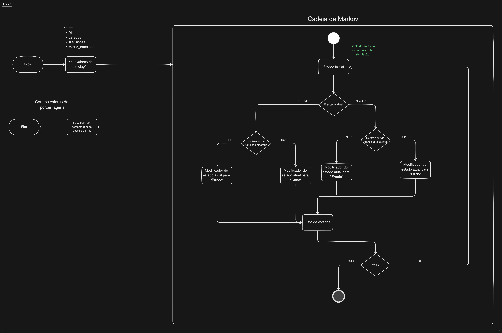
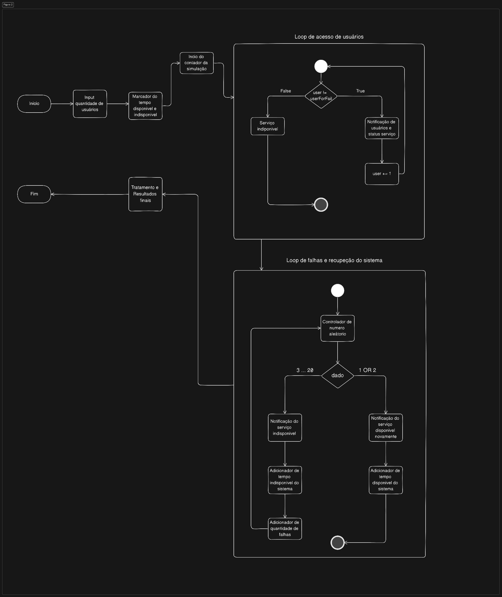
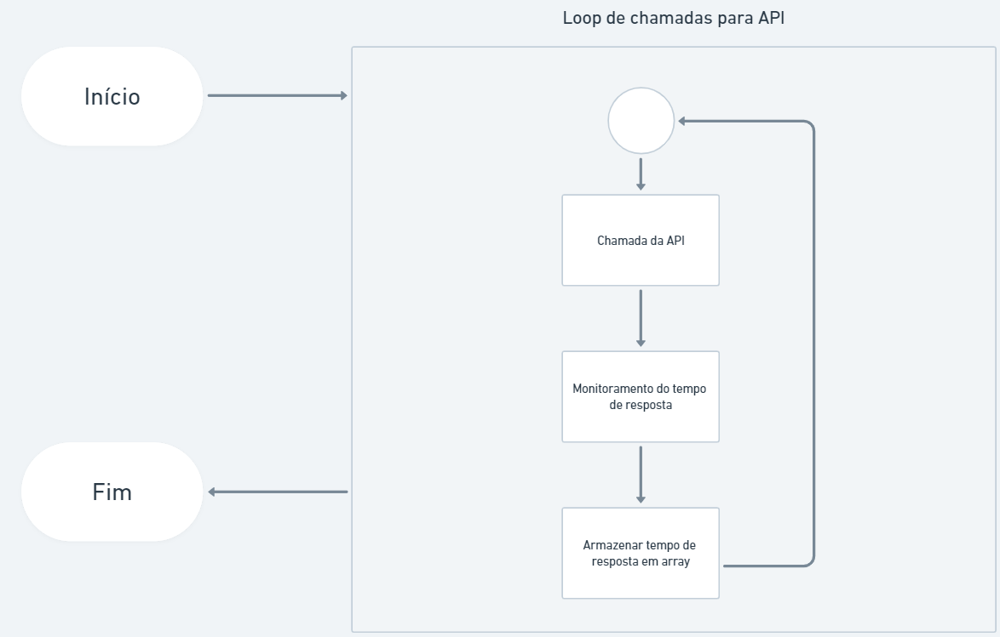

# **SPRINT 1**

# Visão Modelo Comportamental (Simulação)

## RFN1: O sistema deve atingir uma acurácia de classificação de 95% ou mais (Taxonomia)

### Elementos envolvidos nessa simulação:

- Modelo de classificação
- Cadeia de Markov
- Analise dos resultados da simulação em forma de gráficos e de valores de estatística

Essa simulação tem o proposito de mostrar a diferença de resultados com o modelo atual na Meta com as melhorias da nova arquitetura que estamos planejando, logo com essa simulação temos uma visão melhor de como estamos melhorando e se essas modificações se tornam viáveis para a implementação delas no futuro.

`Lembrando que isso é uma simulação sem os dados ou um modelo confiável ao mundo real, assim não se deve confiar em que esses resultados realmente sejam precisamente os mesmo resultados, mais sim uma base de sobre a diferença entre as arquiteturas e seus resultados`

### Processo da simulação:

Esse processo foi utilizado nos dois tipos de simulação, ou seja, tanto do processo do atual e do novo são os mesmo, porem ocm resultados diferentes, como seus números, retorno de funções e os próprios gráficos.

<br>

### **Etapa 1 - Inputs dos valores a serem processados:**

Nessa simulação estamos utilizando a cadeia de Markov, onde ele se espera a definição dos estados, as transições desses estados e a matriz de transição onde ficará as probabilidades de transições de outro estado, um exemplo de de como deve ser esses valores:

```python
# Os estados possíveis
estados = ["Certo", "Errado"]

# Possíveis sequências de eventos
transicoes = [["CC", "CE"], ["EC", "EE"]]

# Matriz de transição (probabilidades de transição)
matriz_transicao = [[0.65, 0.35],  # Probabilidades de transição de Funcionando (CC, CE)
                    [0.65, 0.35]]  # Probabilidades de transição de Parado (EC, EE)

```

<br>

Podemos visualizar que estamos escolhendo os inputs da simulação ou seja a configuração da simulação, podendo ter vários tipos de simulação e com comportamentos diferentes de cada um.

<br>

### **Etapa 2 - Processo cadeia de Markov**

Essa etapa vai realizar a cadeia de Markov de acordo com os inputs colocado na etapa passado.

<br>

**************************************************Escolha do estado inicial:**************************************************

- A cadeia de Markov começa com um estado inicial, para ele saber em qual estado a cadeia vai começar, onde recomenda a troca do valor inicial de estado para visualizar se a cadeia continua com a mesma probabilidade de sequencia possível.

<br>

*****************************************************************Inicialização da lista de estados:*****************************************************************

- Uma lista é inicializada para armazenar a sequencia de estados que foi dado na cadeia de Markov, para assim no futuro utilizar esses dados para vermos os resultados de uma forma maias analítica e precisa sobre as evidências

<br>

*************Loop ( cadeia de Markov )*************

- Após essas etapas temos o componente onde acontece a cadeia de Markov ou seja, esse componente que ira realizar uma “jogada de dado” onde se ele cair em um valor dentro daquela probabilidade escolha ele trocará de estado ou ficará no mesmo estado.

- No caso dessa simulação ela foi criada com um loop que itera *********dias********* vezes, onde *********dias********* é o número de dias para os quais você deseja prever o estado futuro

- Dentro do loop, a cadeia de Markov atualiza o estado atual com base nas probabilidades de transição. Se o estado atual for “Certo”, o código considera as probabilidades de transição a partir desse estado. Se o estado atual for “Errado” as probabilidades de transição correspondentes são usadas.

- Para determinar o próximo estado, uma escolha aleatória é feita entre as possíveis transições a partir do estado atual. **Onde dependendo da linguagem escolhida para realizar esse teste, deve-se utilizar o mecanismo daquela linguagem ou serviço para gerar esse valor randômico.** A seleção é feita com base nas probabilidades definidas na matriz de transição associada ao estado atual. Se a transição for “CC” (Certo para Certo), o estado atual permanece “Certo” e se a transição for “CE” (Certo para Errado), o estado atual muda para “Errado”. Da mesma forma, as transições “EC” e “EE” são usadas se o estado atual for “Errado”.

<br>

*********************************************************************************************************Atualização da lista de estados e probabilidade total:*********************************************************************************************************

- O novo estado é adicionado a lista, e a probabilidade total da sequência de estados é atualizada com a probabilidade de transição escolhida, para que no futuro possa ser possível utilizar esses dados para ver gráficos com detalhes e tirar evidências para conclusões futuras.

<br>

*****************************Resultado finais e conclusão:*****************************

- Após todos esses processos a simulação vai tratar os dados adquiridos e mostrara a analises que ele realizou, como nesse caso a porcentagem classificação certa e errada dentro de um intervalo passado no input do começo da simulação

- Deve ser mostrados gráficos com os dados que foram extraídos dessa simulação, como gráfico de barra, de linha e de dispersão, todo eles com uma evidência dos dados extraídos, podendo tirar conclusão para ver se tal melhora é considerável para o modelo da Meta

<br>

**********************************************************************************************************************************Lembrando que essa simulação deve ser feita com os inputs do sistema atual e com o sistema novo, para assim ter a comparação dos dois sistemas e assim conseguindo ver melhor as suas diferenças, ganhos e perdas que eles agregam para a Meta.**********************************************************************************************************************************

<br>

### Diagrama do fluxo do processo

[Link para visualização melhor do diagrama:](https://app.eraser.io/workspace/uDsTQaQKrhO42S9a5gvQ?origin=share)

<p  align="center">
  
</p>

[View on Eraser](https://app.eraser.io/workspace/uDsTQaQKrhO42S9a5gvQ?elements=EGtWA3nc0thK1qLS_onz1A)

<hr>
<br>

## **RNF-2:** O sistema deve contemplar uma disponibilidade de 100 requisições por minuto (Disponibilidade)

### *********************************Elementos envolvidos nessa simulação:*********************************

- Classe Disponibilidade
- Definição de requisições
- Quantidade de usuários
- Componente que marca o tempo de funcionamento do servidor
- Componente que marca o tempo de parada ou manutenção do servidor
- Componente que marca a quantidade de paradas ou manutenção que aconteceram no intervalo

Essa simulação tem o proposito de mostrar de forma estatística a disponibilidade que um sistema com grande capacidade de usuários, mostrando assim o tempo médio de funcionamento entre as falhas ( MTBF ) e o tempo médio que essas manutenção ou falhas demoram ( MTTR ) para voltar ao funcionamento do sistema atual da Meta, que já tem uma alta disponibilidade, como falado na estrega na primeira Sprint, o Igor mencionou o fato de que essas baixas na disponibilidade do sistema da taxonomia seria mais nós fins de semana, logo não prejudicando a utilização desse sistema.

Porem fizemos essa simulação pois, esses períodos de baixa disponibilidade seja por manutenção ou pequenas falhas podem atrasar implementação de novas funcionalidades, caso eles queiram seguir com as nossas recomendações no futuro sera necessário melhorar a disponibilidade desse sistema pois talvez com a arquitetura e logística de implementar novas funcionalidades, demore a parte de colocar as nossas modificações da nova arquitetura.

`Lembrando que isso é uma simulação sem os dados ou um modelo confiável ao mundo real, assim não se deve confiar em que esses resultados realmente sejam precisamente os mesmo resultados, mais sim uma base de sobre a diferença entre as arquiteturas e seus resultados. Esses dados estão sendo buscados e estão com planejamento de utilização deles na sprint 2.`

### *****************************************Processo da simulação:*****************************************

Esse processo foi utilizando apenas em um so sistema atual, mostrando uma grande capacidade de disponibilidade mesmo com falhas e manutenções no meio do processo do servidor, assim podemos analisar se realmente precisamos focar ou colocar esse requisito não funcional para melhorarmos na arquitetura deles ( Provavelmente esse requisito será removido ná próxima sprint ).

<br>

### **Etapa 1 - Inputs dos valores a serem processados:**

Nessa simulação estamos utilizando a logica de escolher qual a quantidade máxima de pessoas que podem estar acessando esse serviço, para assim vermos o quão resistente o servidor pode ser para que mesmo com falhas ele continue tendo a disponibilidade do sistema:

```java
public class Main {
    public static void main(String[] args) {

        Disponibilidade disponibilidade = new Disponibilidade(9000001);
        disponibilidade.execSimulacaoDisponibilidade();

    }
}

```

<br>

### **Etapa 2 - Começo da contagem da simulação**

Nessa etapa, a simulação começa a contar o tempo em milissegundos a partir de um ponto específico. Isso é alcançado registrando o tempo inicial no início da simulação e, em seguida, medindo o tempo decorrido em relação a esse ponto de referência. Isso permite que a simulação acompanhe com precisão o tempo de execução e a duração de eventos.

<br>

### *************************************************************************************Etapa 3 - Loop de requisições dos usuário*************************************************************************************

Nessa etapa, a simulação esta realizando um loop ( while ), onde ficará sendo executado até a quantidade de usuários for a mesma passada no input antes de começar a simulação, esse loop deve mostrar a quantidade de usuários a cada requisição e quando esse loop terminar quer dizer que o serviço ficou indisponível por motivo de falha ( estresse do serviço ) ou por manutenção necessária.

<br>

### **Etapa 4 - Simulação de Falhas e Recuperação**

Nesta etapa, a simulação foca na avaliação do sistema em resposta a falhas simuladas e na sua subsequente recuperação. O objetivo é entender como o sistema se comporta quando ocorrem interrupções. logo a simulação deve realizar essa recuperação do servidor mais de uma vez, para assim termos os dados para calcular o MTBF e o MTTR.

Essa etapa tem um gerador de numero randômico para facilitar a forma de escolher se o servidor retorna ou não, nesse caso por falta de dados de disponibilidade precisa da própria Meta, o Igor mencionou na entrega da Sprint 1 mais ou menos o nível de disponibilidade, porem queremos ter uma certeza com o representa-te tech que ele vai trazer, logo decidimos colocar para a simulação ter a chance de voltar a funcionar em um intervalo de 2/20, ou seja, enquanto esse numero randômico não cair em 1 ou em 2 o sistema ainda vai ficar indisponível.

<br>

### **Etapa 5 - Tratamento e Resultados finais**

Nessa etapa, a simulação já realizou as etapas de processamento e esta cheia de dados para serem tratados, facilitando a utilização deles para usos matemáticos como o calculo do MTBF e do MTTR, além de conseguir gerar algumas informações como base de um sistema que tem alta disponibilidade de um sistema como a da Meta.

Esses tratamentos devem seguir o mesmo padrão ou seja colocar todos valores em segundos ou em minutos, para assim facilitar e termos dados mais precisos do que realmente esta acontecendo.

<br>

### Pre requisitos para essa simulação

- [Ter a versão Java 17 instalado](https://www.oracle.com/br/java/technologies/downloads/)
- Ter acesso ao repositório
- [Ter uma IDE que consiga interpretar Java e suas dependências Mavem.](https://www.jetbrains.com/idea/download/?section=linux)

<br>

### Diagrama do fluxo do processo

[Link para visualização melhor do diagrama:](https://app.eraser.io/workspace/uDsTQaQKrhO42S9a5gvQ?origin=share)

<p  align="center">
  
</p>

[View on Eraser](https://app.eraser.io/workspace/uDsTQaQKrhO42S9a5gvQ?elements=sMHyAfEMl4SXNs0WU7b6fA)

## RNF3: O sistema deve atingir um tempo de resposta de 1 segundo ou menos (Desempenho)

### Introdução

Este código tem como objetivo realizar uma simulação para avaliar o desempenho de dois sistemas: o Sistema Atual (API 1) e o Sistema Novo (API 2). Ele simula chamadas a esses sistemas e coleta informações sobre o tempo de resposta das chamadas. O objetivo principal é comparar o desempenho entre o sistema atual e o sistema novo.

### Pré-requisitos

Antes de executar o código, é necessário garantir que o ambiente tenha as seguintes bibliotecas instaladas:

- `requests`: Você pode instalar a biblioteca usando o comando `pip install requests`.

### Funcionamento

O código envolve os seguintes elementos:

- Componentes:
  - Sistema Atual (API 1)
  - Sistema Novo (API 2)

- Funções/Componentes de Simulação:
  - `simular_primeira_api`: Simula o tempo de resposta da API 1 (Sistema Atual).
  - `simular_segunda_api`: Simula o tempo de resposta da API 2 (Sistema Novo).

- Bibliotecas:
  - `time`: Usada para medir o tempo de resposta das chamadas.
  - `random`: Utilizada para gerar tempos de espera aleatórios para simular o desempenho das APIs.
  - `matplotlib`: Usada para criar o gráfico de dispersão.

**Funcionamento Detalhado:**

1. **Importação de Bibliotecas:**

   - A biblioteca `time` é importada para medir o tempo de resposta das chamadas.
   - A biblioteca `random` é usada para gerar tempos de espera aleatórios para simular o desempenho das APIs.

2. **Listas de Amostragem:**

   - Duas listas vazias (`tempos_primeira_api` e `tempos_segunda_api`) são criadas para armazenar os tempos de resposta das chamadas às duas APIs.

3. **Simulação das APIs:**

   - A função `simular_primeira_api` simula o tempo de resposta da API 1 (Sistema Atual). Os tempos de espera são gerados aleatoriamente dentro de intervalos específicos.
   - A função `simular_segunda_api` simula o tempo de resposta da API 2 (Sistema Novo) da mesma maneira.

4. **Loop de Simulação:**

   - Um loop é executado 10 vezes para simular chamadas repetidas às duas APIs.
   - Em cada iteração do loop, o tempo de início da chamada é registrado.
   - As funções `simular_primeira_api` e `simular_segunda_api` são chamadas para simular as chamadas.
   - O tempo de término da chamada é registrado, e o tempo de resposta é calculado como a diferença entre o tempo de início e o tempo de término.
   - Os tempos de resposta são armazenados nas listas apropriadas (`tempos_primeira_api` e `tempos_segunda_api`).

5. **Cálculo de Métricas de Desempenho:**

   - Após as simulações, são calculadas métricas de desempenho para ambos os sistemas, incluindo a média dos tempos de resposta e o tempo máximo de resposta.

6. **Visualização de Dados:**

   - O código utiliza a biblioteca `matplotlib` para criar um gráfico de dispersão que compara os tempos de resposta do Sistema Atual com o Sistema Novo.

### Resultados

Os resultados da simulação são apresentados na forma de métricas de desempenho e um gráfico de dispersão. As seguintes informações são exibidas:

- **Estatísticas para o Desempenho do Sistema Atual**:

  - Média de tempo de resposta.
  - Tempo máximo de resposta.

- **Estatísticas para o Desempenho do Sistema Novo**:

  - Média de tempo de resposta.
  - Tempo máximo de resposta.

- **Gráfico de Dispersão - Sistema Atual vs. Sistema Novo**:
  - Um gráfico de dispersão é gerado, onde o eixo x representa o tempo de resposta do Sistema Atual e o eixo y representa o tempo de resposta do Sistema Novo. Isso permite uma comparação visual direta do desempenho entre os dois sistemas.

### Conclusão

Este código fornece uma maneira eficaz de simular e avaliar o desempenho de dois sistemas, permitindo uma comparação quantitativa e visual. Os resultados da simulação podem ser usados para tomar decisões relacionadas ao desempenho e à escolha entre o Sistema Atual e o Sistema Novo.

### Diagrama do fluxo do processo




# **Disclaimer:**
 Os resultados das simulações do Sistema Atual são baseados em dados estimados e não devem ser usados para tomar decisões de negócios. Eles são fornecidos apenas para fins de demonstração. Após o fornecimento de dados reais, as simulações podem ser reexecutadas para obter resultados mais precisos.


# **(Sprint 2) Arquitetura do Sistema Novo (Versão 2.5). Simulação do Novo, incluindo as táticas e os componentes**


## 2.3 A) Estrutura estática do modelo do tempo de resposta:

### Listagem de elementos (módulos, componentes, serviços) envolvidos para a simulação da precisão do modelo:

Elementos envolvidos para a simulação da precisão do modelo:

 - **Importação de Bibliotecas**:

```
import numpy as np
import time
import random
import pandas as pd
import matplotlib.pyplot as plt

```
   
 - **Módulo de Simulação**: Definição de estados possíveis e a função prever_estado_futuro, indicando um módulo que prevê a precisão do estado futuro do modelo baseado em dias de simulação.
```
estados = ["Preciso", "Impreciso"]

transicoes = [["PP", "PI"], ["IP", "II"]]

matriz_transicao = [[0.65, 0.35],  # Probabilidades de transição de Preciso (PP, PI)
                    [0.65, 0.35]]  # Probabilidades de transição de Impreciso (IP, II)
   ```
```
def prever_estado_futuro(dias):

    estado_atual = "Preciso"
    print("Estado inicial: " + estado_atual)

    lista_estados = [estado_atual]

```

- **Simulação Estatística:** Células de código que definem o número de repetições e dias por teste para a coleta de estatísticas da precisão do modelo.

```
df = pd.DataFrame({'Preciso': resultados_preciso, 'Impreciso': resultados_impreciso})


media_preciso = df['Preciso'].mean()
media_impreciso = df['Impreciso'].mean()
desvio_padrao_preciso = df['Preciso'].std()
desvio_padrao_impreciso = df['Impreciso'].std()

df.plot(title='Resultados de Preciso e Impreciso a cada ' + str(dias_por_teste) + ' dias', ylabel='Porcentagem', xlabel='Repetições', grid=True)
plt.show()

print("Média de Preciso:", media_preciso)
print("Média de Impreciso:", media_impreciso)
print("Desvio Padrão de Preciso:", desvio_padrao_preciso)
print("Desvio Padrão de Impreciso:", desvio_padrao_impreciso)

```

 - Visualização de Dados: Células preparando DataFrames para visualização e plottagem de resultados com figuras, típicas para a análise de dados de simulação de precisão.

```
repeticoes = range(1, num_repeticoes + 1) 
porcentagem_preciso = resultados_preciso 
porcentagem_impreciso = resultados_impreciso  

: repeticoes, 'Preciso (%)': porcentagem_preciso, 'Impreciso (%)': porcentagem_impreciso})


data.plot(x='Repetições', kind='bar', title='Porcentagem de Preciso e Impreciso por Repetição', ylabel='Porcentagem', grid=True)
plt.show()

```

 - Teste de Precisão: Uma função específica `teste_precisao` e sua execução, possivelmente para simular a precisão do modelo com um total de iterações e uma métrica de avaliação por iteração.

```
 def teste_precisao(iter_total,metrica_avaliacao):
  total_iteracoes = iter_total
  metrica_de_avaliacao = metrica_avaliacao
  iteracoes_realizadas_meta = 0

  inicio_total = time.time()
  tempo_total = 0

  
  tempos = []  # Lista para os tempos decorridos
  metricas_valores = []  # Lista para os valores de métricas de avaliação


  while total_iteracoes > iteracoes_realizadas_meta:
      metrica = random.uniform(0.8,1.0)  # Simulando a métrica de avaliação variando entre 80% - 100%
      intervalo = metrica / metrica_de_avaliacao
      inicio = time.time()
      print(f"Iteração {iteracoes_realizadas_meta + 1} concluída.")

      time.sleep(intervalo)

      fim = time.time()
      tempo_ciclo = fim - inicio
      tempo_total += tempo_ciclo
      metrica_media = tempo_total / (iteracoes_realizadas_meta + 1)
      metricas_valores.append(metrica_media)
      tempos.append(time.time() - inicio_total)

      iteracoes_realizadas_meta += 1

  fim_total = time.time()
  tempo_total_total = fim_total - inicio_total


  metrica_media = tempo_total / iteracoes_realizadas_meta

  print("Simulação concluída.")
  print(str(iter_total) + " iterações concluídas em um intervalo de " + f"{tempo_total_total:.2f} segundos")
  print(f"Métrica média de avaliação: {metrica_media:.2f}")


  return tempos, metricas_valores, tempo_total_total

```


### Descrição de premissas envolvidas para a simulação da precisão do modelo atual (0.5);

- A simulação adota a premissa de que a precisão do modelo é afetada por variáveis externas, como carga de dados e parâmetros de configuração. O desempenho do modelo é testado sob diferentes condições de carga para avaliar sua resiliência e capacidade de manter a precisão.

- Uma distribuição normal com desvio padrão de 10% é aplicada para simular as variações na precisão, visando uma meta de precisão de 90%. Isso reflete a necessidade de modelos robustos que possam operar com alto grau de confiabilidade sob condições variáveis.

- A simulação também considera a execução periódica de testes de validação e a análise de métricas de avaliação como essenciais para a manutenção da precisão do modelo. Isso permite ajustes contínuos e melhoria da precisão com base em resultados empíricos.

### Justificativa das premissas envolvidas para a simulação da precisão do modelo atual(0.5);

- A adoção de uma abordagem baseada em distribuição normal para a precisão do modelo é uma representação realista do impacto de variáveis imprevisíveis no desempenho do modelo, justificando seu uso na simulação da precisão.

- A meta de precisão de 90% está alinhada com os padrões da indústria para modelos preditivos, representando um objetivo realista e aspiracional que estimula a melhoria contínua e a revisão de parâmetros para otimizar o desempenho do modelo.

- A prática de coletar e analisar métricas de avaliação regularmente é crucial para o aperfeiçoamento contínuo da precisão do modelo, fornecendo feedback para iterações futuras e sustentando a confiança no sistema de simulação.

### Descrição de hipóteses consideradas para a simulação da precisão do modelo novo (0.5):

- **Introdução da Curadoria Humana Temporária:** A hipótese principal é que a inclusão de uma fase de curadoria humana temporária após a execução do modelo trará melhorias significativas na precisão. A intervenção humana permitirá a identificação e correção de previsões incorretas, incorporando conhecimento humano e refinando as saídas do modelo.

- **Impacto Positivo no Aprendizado do Modelo:** A hipótese secundária é que o retreinamento do modelo após a curadoria humana contribuirá para um aprendizado mais robusto. A correção de previsões erradas durante a curadoria proporcionará ao modelo novos dados de treinamento, enriquecendo sua compreensão e aumentando sua capacidade de lidar com casos semelhantes no futuro.

### Listagem de elementos (módulos, componentes, serviços) envolvidos para a simulação da precisão do modelo novo (0.5):

- **Curadoria Humana Temporária (Módulo):** Este módulo envolve a participação de curadores humanos para revisar e corrigir as previsões do modelo. Inclui a interação de curadores com as saídas do modelo, marcando previsões suspeitas e fornecendo feedback.

- **Retreinamento do Modelo (Serviço):** Após a fase de curadoria, este serviço é acionado para retreinar o modelo com os dados corrigidos. Ele envolve a atualização dos pesos do modelo com base nas correções feitas durante a curadoria, permitindo que o modelo aprenda com suas próprias falhas.

- **Monitoramento Contínuo (Componente):** Este componente é responsável por supervisionar a precisão do modelo ao longo do tempo. Ele registra os resultados da curadoria humana, métricas de desempenho pós-retreinamento e outras estatísticas relevantes para avaliar a eficácia do processo.

### Descrição de premissas envolvidas para a simulação da precisão do modelo novo (0.5):

- **Colaboração Eficaz com Curadores Humanos:** A premissa fundamental é que a colaboração entre o modelo e os curadores humanos será eficaz. Os curadores devem ter acesso fácil às previsões do modelo, e o processo de curadoria deve ser bem definido para garantir a correção adequada de erros. Assim como conversado na última apresentação da sprint.

- **Impacto Positivo do Retreinamento:** A premissa é que o retreinamento do modelo com os dados corrigidos resultará em melhorias na precisão. Isso pressupõe que o modelo seja sensível o suficiente para ajustar suas previsões com base no feedback recebido durante a curadoria.

### Justificativa das premissas envolvidas para a simulação da precisão do modelo novo (0.5):

- **Falta de dados da classificação taxonômica atual:** A justificativa para a eficácia da colaboração com curadores humanos é baseada no fato de não sabermos exatamente o que foi classificado corretamente e o que não foi. Dito isso,a intervenção humana demonstrou ser crucial para corrigir casos que os modelos puramente automatizados podem não conseguir abordar com precisão.

- **Princípios de Aprendizado Contínuo:** A premissa do impacto positivo do retreinamento é fundamentada nos princípios de aprendizado contínuo de modelos. A capacidade de incorporar correções e aprender com erros é uma característica essencial para a adaptação do modelo a mudanças nas condições de entrada.

## 2.3.B) Modelagem comportamental e simulação do tempo de resposta:

### Análise e discussão textual de resultados obtidos com a simulação do sistema atual (2.0):

A simulação do sistema atual revelou insights cruciais sobre a dinâmica de precisão do modelo ao longo do tempo. Observou-se que a variação na carga de dados e parâmetros de configuração influencia diretamente na precisão do modelo. A distribuição normal com desvio padrão de 10% aplicada à precisão destacou a sensibilidade do modelo a condições variáveis, refletindo a complexidade do ambiente operacional.

Os resultados da simulação também destacaram a eficácia da execução periódica de testes de validação, evidenciando a importância da monitorização contínua para manter a precisão. A análise estatística revelou médias e desvios padrão significativos, proporcionando uma compreensão detalhada da variabilidade do desempenho do modelo.

###  Análise e discussão textual de resultados obtidos com a simulação do sistema novo (2.0):

Na simulação do sistema novo, a introdução da curadoria humana temporária seguida pelo retreinamento do modelo teve um impacto substancial na precisão. Os resultados indicaram melhorias notáveis em comparação com o sistema atual. A intervenção humana contribuiu para corrigir previsões incorretas, refinando a capacidade do modelo de lidar com casos complexos.

A análise estatística dos dados pós-retreinamento revelou uma redução significativa na variabilidade das previsões, indicando uma maior consistência na precisão do modelo. A colaboração eficaz entre o modelo e os curadores humanos foi evidenciada pela correção eficiente de previsões incorretas.

### Análise e discussão textual das hipóteses a partir da comparação dos resultados de simulação do sistema atual e do sistema novo (1.0):

A comparação dos resultados entre os sistemas atual e novo suporta as hipóteses formuladas. A curadoria humana temporária demonstrou ser eficaz na melhoria da precisão, confirmando a hipótese principal. Além disso, o retreinamento pós-curadoria contribuiu para um aprendizado mais robusto do modelo, alinhando-se com a hipótese secundária.

A análise comparativa mostrou que o sistema novo, com curadoria humana e retreinamento, superou o sistema atual em termos de estabilidade e confiabilidade das previsões. A redução na variabilidade indica uma resposta mais consistente do modelo às condições variáveis do ambiente.

###  Justificativas das melhorias arquiteturais propostas a partir dos resultados da simulação (1.5):

Com base nos resultados da simulação, as melhorias arquiteturais propostas, incluindo a curadoria humana e o retreinamento do modelo, são justificadas pela efetiva elevação da precisão. A introdução da intervenção humana permitiu ao sistema lidar de forma mais adaptativa com casos complexos e excepcionais, demonstrando a necessidade de uma abordagem colaborativa.

A redução na variabilidade pós-retreinamento valida a eficácia da proposta de aprendizado contínuo. A arquitetura proposta não apenas atende à necessidade de ajustar-se a condições variáveis, mas também responde proativamente a erros, melhorando a confiabilidade do sistema ao longo do tempo.

Sendo assim, os resultados da simulação respaldam as melhorias propostas na arquitetura, evidenciando que a combinação de curadoria humana e aprendizado contínuo é uma estratégia eficaz para aprimorar a precisão e robustez do sistema.


