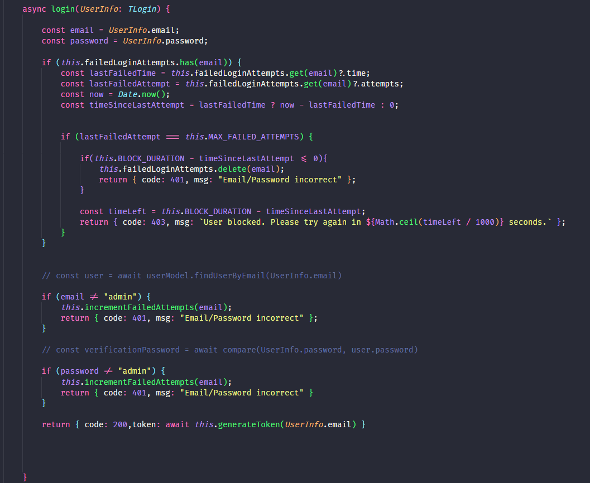

# Demo
## Objetivo
A demo desenvolvida conta com uma plataforma web, que permite uma interação user friendly entre o colaborador da Meta - responsável pelo projeto de classificação das compras - e o modelo de classificação desenvolvido.

## Componentes
O sistema desenvolvido conta com os seguintes componentes:
1. Front-end desenvolvido em next.js e typescript;
2. API em flask que contém o modelo de classificação (input aceito: dados de compra; output: Level 2 de classificação);
3. API em node, que conta com o sistema de login do sistema, com foco especial no RNF de segurança.

O sistema está estruturado com a utilização de Docker, e está deployado em uma máquina virtual do ambiente em cloud da Azure.

### Front-end
A interface conta com duas telas:
1. Página de login
2. Home: Um formulário, em que o usuário seleciona o valor desejado em relação a cada item necessário da compra, e recebe o Level 2 (classificação), e o nível de precisão da classificação.

Figura 1. Interface da demo

### Back-end em python (API em flask do modelo)

A API envia os dados recebidos do formulário para uma pipeline de tratamento e classificação, e retorna a classe mais compatível com as informações recebidas, através da utilização do modelo KNN.

Figura 2. Pipeline de classificação

### Back-end em node (API login)

A API de segurança está fazendo toda a parte de autenticação do sistema, ou seja, quando o usuário tenta realizar a autenticação, caso sucesso o usuário irá receber um token com um payload do seu ID onde poderá ter acesso para utilizar a aplicação, no caso da demonstração apenas o usuário: Admin | senha:Admin, para conseguir ter acesso a aplicação.

Figura 3. Service de segurança da API